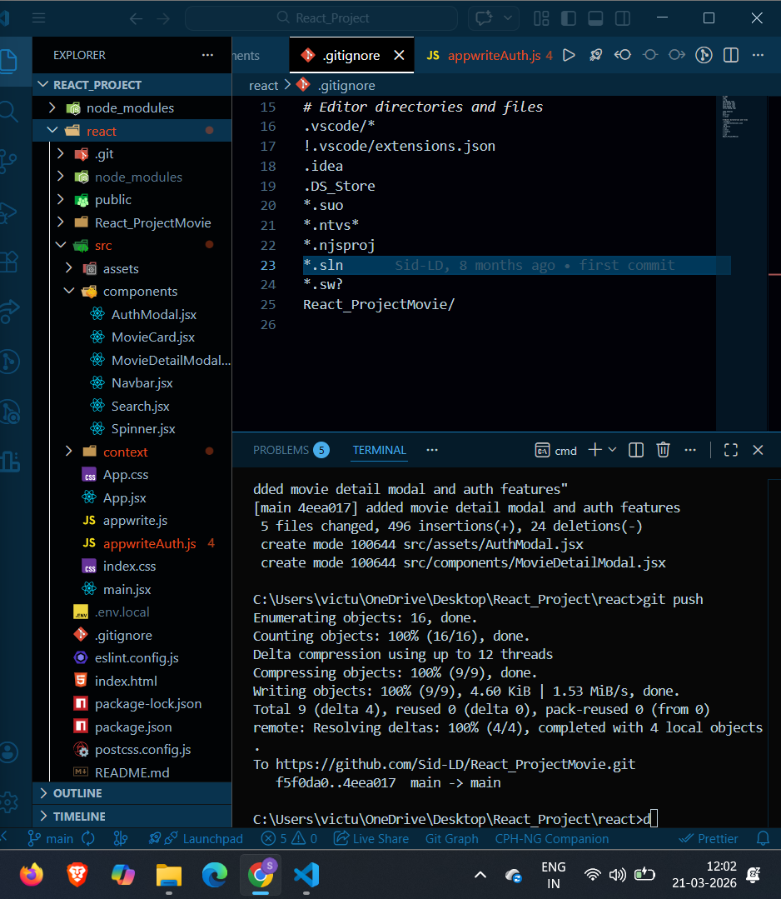

# 🎬 CineSearch

<div align="center">



**A full-stack AI-powered movie discovery platform built with React, Appwrite & Groq AI**

[](https://react.dev)
[](https://vitejs.dev)
[](https://tailwindcss.com)
[](https://appwrite.io)
[](LICENSE)

[🔗 Live Demo](your-deployed-link-here) · [🐛 Report Bug](https://github.com/Sid-LD/React_ProjectMovie/issues) · [✨ Request Feature](https://github.com/Sid-LD/React_ProjectMovie/issues)

</div>

---

## 📋 Table of Contents

- [About The Project](#-about-the-project)
- [Features](#-features)
- [Tech Stack](#️-tech-stack)
- [Project Structure](#-project-structure)
- [Getting Started](#-getting-started)
  - [Prerequisites](#prerequisites)
  - [Installation](#installation)
  - [Environment Variables](#environment-variables)
- [Appwrite Setup](#-appwrite-setup)
- [How It Works](#-how-it-works)
- [Screenshots](#-screenshots)
- [Deployment](#-deployment)
- [Roadmap](#-roadmap)
- [Author](#️-author)
- [License](#-license)

---

## 🎯 About The Project

**CineSearch** is a modern, full-stack movie discovery application that helps users find movies they'll actually enjoy. It combines real-time movie data from TMDB, a live trending system powered by Appwrite, and an AI recommendation engine built on Groq's Llama 3.3 model.

Users can search across thousands of movies, view detailed information including cast, trailers, and ratings, sign up for a personalized account, and ask an AI to recommend movies based on their current mood.

### Why I built this

This project was built to demonstrate a complete full-stack React application with real-world features including:
- Third-party API integration (TMDB)
- Backend-as-a-Service (Appwrite) for database and auth
- AI API integration (Groq)
- Production-quality UI with Tailwind CSS v4
- Proper state management and component architecture

---

## ✨ Features

### 🔍 Smart Movie Search
- Debounced search input — API calls fire only after the user stops typing (500ms delay)
- Searches across thousands of movies via TMDB API
- Real-time results with smooth loading states

### 🔥 Live Trending System
- Tracks which movies users search for most
- Stores search counts in Appwrite database in real time
- Displays top 5 trending movies in a horizontal scroll section
- Updates automatically as users search

### 🎬 Movie Detail Modal
- Click any movie card to open a full detail view
- Shows: synopsis, genres, runtime, release year, budget, revenue, popularity
- **Top 10 cast** with profile photos, names, and character names
- **YouTube trailer** embedded and playable directly in the app
- Backdrop image with cinematic gradient overlay
- Closes on `Escape` key or clicking outside

### 🤖 AI Movie Recommender
- Powered by **Groq API** (Llama 3.3 70B model)
- User types their mood or preference in natural language
- AI returns 5 personalized movie recommendations instantly
- Each recommendation includes title, year, genre, rating, and reason
- Color-coded genre badges and hover animations
- Quick-select mood chips for fast interaction

### 🔐 Authentication System
- Email/password sign up and sign in
- Powered by **Appwrite Authentication**
- Persistent sessions — stays logged in on refresh
- Navbar updates dynamically based on auth state
- Protected user experience

### 🎨 Landing Page
- Animated hero section with floating gradient orbs
- Shimmer text animation on the main heading
- Feature cards grid showcasing all app capabilities
- Stats section and call-to-action buttons
- Glassmorphism navbar with blur effect

### 📱 Responsive Design
- Works on mobile, tablet, and desktop
- Tailwind CSS v4 with custom breakpoints
- Mobile-first approach throughout

---

## 🛠️ Tech Stack

| Technology | Version | Purpose |
|---|---|---|
| **React** | 18 | Frontend UI framework |
| **Vite** | 7.0 | Build tool and dev server |
| **Tailwind CSS** | v4 | Utility-first styling |
| **Appwrite** | Cloud | Database + Authentication |
| **TMDB API** | v3 | Movie data, posters, trailers, cast |
| **Groq API** | Latest | AI movie recommendations (Llama 3.3) |
| **react-use** | Latest | Debounce hook for search |

---

## 🗂️ Project Structure

```
React_ProjectMovie/
└── react/                          # Main React application
    ├── public/
    │   ├── hero.png                # Hero banner image
    │   ├── hero-bg.png             # Background pattern
    │   ├── star.svg                # Star rating icon
    │   └── no-movie.png            # Fallback movie poster
    ├── src/
    │   ├── components/
    │   │   ├── AIRecommender.jsx   # AI-powered movie recommendations
    │   │   ├── AuthModal.jsx       # Login / Sign up modal
    │   │   ├── LandingPage.jsx     # App landing page
    │   │   ├── MovieCard.jsx       # Movie card with hover effects
    │   │   ├── MovieDetailModal.jsx# Full movie details + trailer
    │   │   ├── Navbar.jsx          # Navigation with auth state
    │   │   ├── Search.jsx          # Debounced search input
    │   │   └── Spinner.jsx         # Loading spinner
    │   ├── context/
    │   │   └── AuthContext.jsx     # Global authentication state
    │   ├── App.jsx                 # Root component + routing logic
    │   ├── appwrite.js             # Appwrite database functions
    │   ├── appwriteAuth.js         # Appwrite auth functions
    │   ├── index.css               # Global styles + Tailwind config
    │   └── main.jsx                # React entry point
    ├── .env.local                  # Environment variables (not committed)
    ├── .gitignore
    ├── index.html
    ├── package.json
    ├── postcss.config.js
    └── vite.config.js
```

---

## 🚀 Getting Started

### Prerequisites

Make sure you have the following installed:
- **Node.js** v18 or higher — [Download](https://nodejs.org)
- **npm** v9 or higher (comes with Node.js)
- An **Appwrite** account — [Sign up free](https://appwrite.io)
- A **TMDB** API key — [Get one free](https://www.themoviedb.org/settings/api)
- A **Groq** API key — [Get one free](https://console.groq.com)

### Installation

**1. Clone the repository**
```bash
git clone https://github.com/Sid-LD/React_ProjectMovie.git
```

**2. Navigate into the project**
```bash
cd React_ProjectMovie/react
```

**3. Install dependencies**
```bash
npm install
```

**4. Set up environment variables** (see below)

**5. Start the development server**
```bash
npm run dev
```

**6. Open in your browser**
```
http://localhost:5173
```

### Environment Variables

Create a `.env.local` file inside the `react/` folder:

```env
# TMDB API (Movie data)
VITE_TMDB_API_KEY=your_tmdb_bearer_token_here

# Appwrite (Database + Auth)
VITE_APPWRITE_PROJECT_ID=your_appwrite_project_id
VITE_APPWRITE_DATABASE_ID=your_appwrite_database_id
VITE_APPWRITE_COLLECTION_ID=your_appwrite_collection_id

# Groq AI (Movie recommendations)
VITE_GROQ_API_KEY=your_groq_api_key_here
```

> ⚠️ **Never commit `.env.local` to GitHub.** It's already in `.gitignore`.

---

## 🔧 Appwrite Setup

### 1. Create a Project
- Go to [cloud.appwrite.io](https://cloud.appwrite.io)
- Click **Create Project** and name it `CineSearch`
- Copy your **Project ID**

### 2. Create a Database
- Go to **Databases** → **Create Database**
- Name it `CineSearch DB`
- Copy your **Database ID**

### 3. Create a Collection
- Inside your database, click **Create Collection**
- Name it `movies`
- Copy your **Collection ID**

### 4. Add Attributes
Add these attributes to your collection:

| Attribute | Type | Size | Required |
|---|---|---|---|
| `searchTerm` | String | 255 | ✅ |
| `count` | Integer | — | ✅ |
| `movie_id` | Integer | — | ✅ |
| `poster_url` | String | 500 | ✅ |

### 5. Set Permissions
- Go to your collection's **Settings** tab
- Under **Permissions**, add:
  - `Any` → Read
  - `Any` → Create
  - `Any` → Update

### 6. Enable Authentication
- Go to **Auth** in your Appwrite console
- Make sure **Email/Password** is enabled under **Auth Methods**

---

## ⚙️ How It Works

### Search & Trending Flow
```
User types in search box
    → Debounce waits 500ms
    → TMDB API called with search query
    → Results displayed as movie cards
    → If results found, Appwrite DB updated with search count
    → Trending section re-ranks top 5 most searched movies
```

### AI Recommendation Flow
```
User describes their mood
    → Request sent to Groq API (Llama 3.3 70B)
    → AI returns structured JSON with 5 movie picks
    → Results parsed and displayed with genre badges
```

### Authentication Flow
```
User clicks Sign In
    → AuthModal opens
    → Credentials sent to Appwrite Auth
    → Session stored by Appwrite SDK
    → AuthContext updates globally
    → Navbar reflects logged-in state
```

---

## 📸 Screenshots

> Add screenshots here after deployment. Here's how:
> 1. Open your live app in Chrome
> 2. Press `F12` → `Ctrl+Shift+M` for mobile view
> 3. Take a screenshot with `Windows + Shift + S`
> 4. Upload the image to your GitHub repo
> 5. Replace this section with ``

---

## 🌐 Deployment

This app is deployed on **Vercel**.

### Deploy your own in 3 steps:

**1. Push to GitHub**
```bash
git add .
git commit -m "ready to deploy"
git push
```

**2. Import on Vercel**
- Go to [vercel.com](https://vercel.com)
- Click **Add New Project**
- Import your GitHub repo
- Set **Root Directory** to `react`

**3. Add Environment Variables**
- In Vercel project settings → **Environment Variables**
- Add all variables from your `.env.local`

**4. Deploy!**
- Vercel auto-deploys on every `git push` from now on

---

## 🗺️ Roadmap

- [x] Movie search with debounce
- [x] Trending movies with Appwrite
- [x] Movie detail modal with trailer
- [x] Authentication (sign up / sign in)
- [x] AI movie recommender (Groq)
- [x] Landing page
- [ ] Watchlist feature
- [ ] Genre filters
- [ ] Infinite scroll / pagination
- [ ] PWA support (installable on mobile)
- [ ] Unit tests with Vitest

---

## 🙋‍♂️ Author

**Siddhant** (Sid-LD)

- GitHub: [@Sid-LD](https://github.com/Sid-LD)
- LinkedIn: [Add your LinkedIn here]

---

## 📄 License

This project is open source and available under the [MIT License](LICENSE).

---

## 🙏 Acknowledgements

- [TMDB](https://www.themoviedb.org/) for the movie data API
- [Appwrite](https://appwrite.io/) for the backend infrastructure
- [Groq](https://groq.com/) for the blazing-fast AI API
- [Tailwind CSS](https://tailwindcss.com/) for the utility-first styling

---

<div align="center">
  Built with ❤️ by <a href="https://github.com/Sid-LD">Sid-LD</a>
</div>
